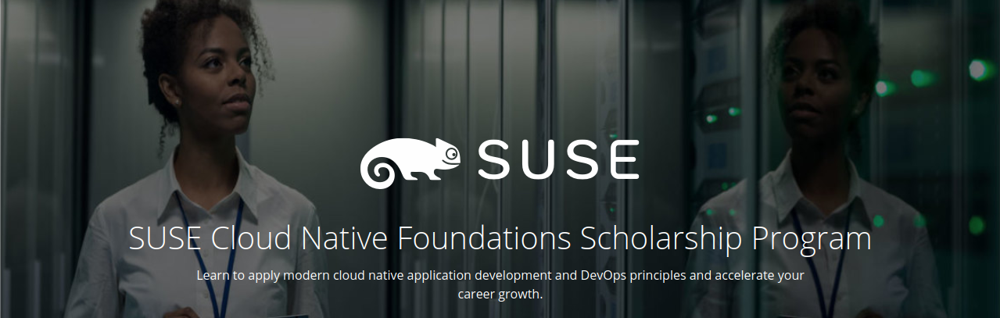

# SUSE Cloud Native Foundations Scholarship
Udacity is collaborating with SUSE, a global leader in true open source solutions, to empower developers and operations specialists to meet today's high growth career challenges. We invite students 18 years of age or older who want to build new cloud native application development, deployment, and management skills to apply to the SUSE Cloud Native Foundations Scholarship Program.

Item | Description
----- | -------
Course | https://www.udacity.com/scholarships/suse-cloud-native-foundations-scholarship
Syllabus| https://d20vrrgs8k4bvw.cloudfront.net/documents/en-US/Cloud+Native+Application+Architecture+Nanodegree+Program+Syllabus.pdf
Site Course Homepage | https://sites.google.com/udacity.com/suse-cloud-native-foundations/home
Instructor | Katie Gamanji https://github.com/kgamanji
Phase 1 Starts |  Monday, June 7th, 2021
Phase 1 Ends   | Monday, August 2nd, 2021 @ 11:59 PM PT
Prerequisites| For this course, students should be comfortable with: web application development with Python, using the CLI or command-line interface, using git commands creating a DockerHub account.
Course Outline| Welcome, Architecture Considerations,  Container Orchestration, Open Source PaaS, Cloud Native CI/CD

✨| Udacity SUSE Cloud Native Fundamentals Scholarship Program Nanodegree Program | Status
--- | ---| ---
1 | Introduction to Cloud Native Fundamentals |  &#9745;
2 | Architecture Consideration for Cloud Native Applications |  &#9745;
3 | Container Orchestration with Kubernetes | &#9745;
4 | Open Source PaaS |  &#9745;
5 | CI/CD with Cloud Native Tooling |&#9745;

### Make sure you have the following dependencies installed:

✨ | Tool / Dependency / Environment | Logo | Link
--- | --- | --- | ---
1 | Python |  | [🔗](https://www.python.org/downloads/)
2 | Git |  | [🔗](https://git-scm.com/downloads)
3 | Docker |  | [🔗](https://docs.docker.com/get-docker/)
4 | Vagrant |  | [🔗](https://www.vagrantup.com/downloads)
5 | VirtualBox |  | [🔗](https://www.virtualbox.org/wiki/Downloads)

** Note: Make sure that you have installed VirtualBox in 6.1.16 or a higher version**

** Setup these Tools in your local machine and get started for the course! 🎉**
